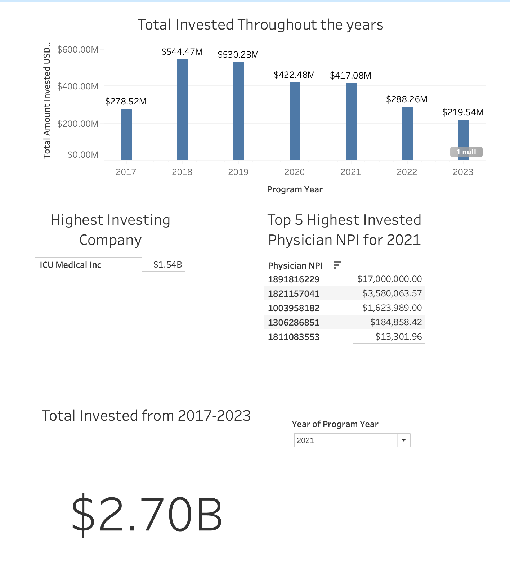

# CMS_Payment_DEZoomcampProject
This is the repository for my Data Engineering Zoomcamp Project

Open Payments CMS Data has datasets that track payments to and from industries and healthcare providers.  The mission statement is from the Open Payments Data CMS website:  

```
Program Overview
The mission of the program is to provide the public with a more transparent health care system.

Open Payments collects and publishes information about financial relationships between drug and medical device companies (referred to as "reporting entities") and certain health care providers (referred to as "covered recipients"). These relationships may involve payments to providers for things including but not limited to research, meals, travel, gifts or speaking fees.

All information available on the Open Payments database is open to personal interpretation and if there are questions about the data, patients and their advocates should speak directly to the health care provider for a better understanding.
```

By tracking the data, we aim to gain insights into how companies are influencing the healthcare industry through their spending. Analyzing patterns of higher-than-average spending in specific one-to-one relationships may reveal fraudulent or corrupt practices within certain companies.

The datasets come in 3 types: General, Research and Ownerships
General: Biggest of all the datasets, by defintion: "Payments that are not associated with a research study".  Contains any general payments subcategorized but not limited various types of payments whether its stocks, fees, gifts, memorabilia, grants, research, entertaintment, travel, accomadations.

Research payments:
Payments that are associated with a research study.

Ownership and Investment interests
Ownership and investment interest includes, but is not limited to:

* Stock
* Stock option(s) (other than those received as compensation, until they are exercised)
* Partnership share(s)
* Limited liability company membership(s)
* Loans
* Bonds or
other financial instruments that are secured with an entity’s property or revenue or a portion of that property or revenue

In this pipeline we will only be extracting the Ownershsip and Invemtment interests datasets from year 2017-2023.

## Tools used for this project:

Python with Pandas  
Airflow for Orchestration  
Google Cloud Storage  
Google BigQuery  
Tableau as Data Visualization  
Terraform for Google Bucket Creation, IaC  

## Workflow

* Python was used to request and download CSVs by a local homeserver
* Pandas was then used to clean and set the schema for the data before being saved as a csv: OWNRSHP_{year}_correctPD.csv
* That data was saved to the local server then uploaded to Google Storage Bucket
* Those CSVs were then uploaded by code to Google BigQuery as an external table
* All 4 steps were performed as its own PythonOperator in Airflow.

Here is my dashboard with the relative data:



Following is the link to the interactive dasbhboard:

https://public.tableau.com/views/CMSDashboard_17448285989530/OwnershipInvestmentDashboard?:language=en-US&publish=yes&:sid=&:redirect=auth&:display_count=n&:origin=viz_share_link

# Future Plans

I would like to explore the general payment dataset, but it would also require more exploration and setup with pyspark as those data sets are in the tens of millions rows long. Keep following the repo and project for future updates on the development of this project.


